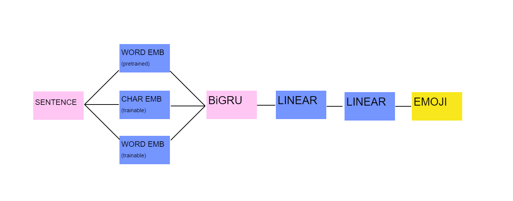

# caption2emoji
**Aima Allik, Joonas Järve, Shumpei Morimoto**

### Objective
The plan is to create a NLP model that is capable to assign/predict emojis to given caption/tweet/text. 
To illustrate the idea, let's think of a typical predictive keyboard that suggest us the next words. This is very similar to our goal, the model will predict an emoji corresponding to the inserted text. The idea is partly based on the article [Multimodal Emoji Prediction](https://arxiv.org/pdf/1803.02392.pdf) by Francesco Barbieri et al.

For researching the topic and writing a related work we have chosen the following papers(the initials following the papers imply the one who worked it through):
* [Multimodal Emoji Prediction](https://arxiv.org/pdf/1803.02392.pdf) --JJ
* [A Semantics-Based Measure of Emoji Similarity](https://arxiv.org/pdf/1707.04653.pdf) --SM
* [Emoji Representations from their Description](https://arxiv.org/pdf/1609.08359.pdf) --AA
* [Emojitalianobot and EmojiWorldBot](http://ceur-ws.org/Vol-1749/paper37.pdf) --JJ
* [Emoji Prediction: Extensions and Benchmarking](https://arxiv.org/ftp/arxiv/papers/2007/2007.07389.pdf) --AA
* [Are Emojis Predictable?](https://arxiv.org/pdf/1702.07285.pdf) --JJ

### Data
The main dataset will be 1M sentences with emoji from Twitter about 2017-Jan but the search is still in progress for new additional datasets. We are also deciding whether to use the emoji descriptions in training and/or testing.

### Evaluation
In most of the articles, goodness is usually measured with traditional recall, precision, accuracy and F-score. In addition to the latter measures, as the target is rather subjective we cannot really tell which is the gold label or if we are not assigning too big of an error to the wrong label, although some emojis are very similar (e.g :smiley: and :smile:). Therefore, we could use a different measure. One way is to measure the predicted emoji similarity with the initial description of the emoji. The other way would be to evaluate the prediction which was in the users head. So, for that, we might need to carry out an extrinsic evaluation in the end to find out the model's actual performance.

### Related work
In this section we will give a slight overview of what has been done earlier and mention the papers' similarities to our project. Some of the papers are more related to our project but some of the chosen ones face the wide world of emoji research from the different perspective i.e embeddings perspective. Nevertheless, we included them, as they point out the possibilities of the area.

* [Are Emojis Predictable?](https://arxiv.org/pdf/1702.07285.pdf)
After some additional research, we found a paper that very much does exactly what we are planning to do. In a way it was a good finding as it will provide us some more useful insights to the problem. The authors train a bidirectional LSTM to predict emojis based on tweets. They use word and character-based embeddings to represent tokens. The dataset consists of half a million tweets with only 20 different emojis. As a baseline model, they use *Bag of Words* and *skip-gram vector average* models. The best results were achieved with character-based embeddings and b-LSTM. In contrary to this article, we plan to try to concatenate the word- and character-based embeddings, use GRU instead and try with CNN as well. The amount to emojis taken to the project is still an open question from our side.

* [Multimodal Emoji Prediction](https://arxiv.org/pdf/1803.02392.pdf)
This paper is an advancement of the previous *Are Emojis Predictable?* by not only taking account the text but also the picture. For such task, authors used Instagram posts. They used a smaller dataset but also with pictures. They used the previous article model as a baseline and ResNet based model alongside with the *FastText* model. They showed that additional visual information provides slightly better results. In our work, we will stick to text and not include any visual extras as the improvement were not so vast.

* [Emojitalianobot and EmojiWorldBot](http://ceur-ws.org/Vol-1749/paper37.pdf)
The authors of this paper have created a bot that translates textual language to emojis and vice versa. This is rather different from our goal but has brought attention to extrinsic evaluation means such as *crowdscourcing*. They also mention the annotations that provide labels for Unicode characters i.e [emojis](https://www.unicode.org/cldr/cldr-aux/charts/29/annotations/uralic.html) in our case.

* [A Semantics-Based Measure of Emoji Similarity](https://arxiv.org/pdf/1707.04653.pdf)
This paper analyzed the semantic similarity of emoji through embedding models using the word embedding model, which is called the emoji embedding model. Emojis were extracted into machine-readable emoji description(called sense) from EmojiNet. The author of this paper created a new dataset called *EmoSim508* to evaluate the emoji embedding models' performance. EmoSim508 is a human-annotated semantic similarity score of 508 carefully selected emoji pairs. The emoji embedding model learned on sense labels, correlate best with the created dataset's emoji similarity ranking. The paper also shows the result of the real-world use-case of the emoji embedding models, which is used in a sentiment analysis task.

* [Emoji Representations from their Description](https://arxiv.org/pdf/1609.08359.pdf)
In this paper, the representation of emojis were estimated directly and only from their Unicode description, whereas we plan to use tweets as the main training data. The plus side of using tweets is that the model will also be prepared for not so perfect scenarios like the usage of sarcasm. As in some previously mentioned papers, they also used the *Bag of Words* approach for encoding descriptions. They released *emoji2vec* which has embeddings of 1661 emoji symbols, but in our project, we will lack the chance of using them as the emoji itself will not be included in the training set.  

* [Emoji Prediction: Extensions and Benchmarking](https://arxiv.org/ftp/arxiv/papers/2007/2007.07389.pdf)
The goal of the paper is very similar to ours - to predict the most appropriate emoji(s) to a given piece of text. They used the BERT and DeepMoji models for prediction. The authors address the problem of the lack of a benchmark dataset in the field of emoji prediction. They state that the insufficent means make it difficult to compare the performances of different emoji prediction models. Therefore, they provide such benchmark datasets and are waiting for other researchers to base their work on the datasets. As this article is fairly new (from August of 2020), it is a good opportunity for us to make use of the data. The only downside seems to be that the data and code for this paper is available only upon request.

### Method

The initial idea of building a RNN or CNN has been revised due to the last practice session where we covered BERT model. As, paper [Are Emojis Predictable?](https://arxiv.org/pdf/1702.07285.pdf) can provide us a very good comparison, we will definately try to implement GRU based recurrent network. In addition, we will create a BOW baseline model TF-IDF and hopefully an advancement to the RNN model- BERT. 

For TF-IDF, BERT and RNN implementations- we will use the materials from the homeworks as they provide a very good starting point for our own specific implementation. So, we will not write our code from scratch and can more concentrate on adaption, performance and evaluation. Therefore we will use *PyTorch* framework.

**BiGRU** based model. We will use three types of embeddings: character based, word based pretrained and word based trainable embeddings. The use of character based embeddings is very much necessary as we are dealing with texts from social media which do not tend to be grammatically correct nor standard. The emedded sentences will be sent to bidirectional GRU layer and on top of it we will use two linear layers with Relu activation functions. Dropout might be also considered regularization. In the end we will have a softmax layer which outputs the probability of the correct emoji. Here is a figure of the structure as well.  

**BERT** based model. We will train a multi-class classifier by fine-tuning BERT from transformers library by HuggingFace. We will not use the large BERT but the light-weight version *DistilBert* with AdamW optimizer. 

As related work does not give a plain signal if balanced or unbalanced data is better in emoji prediction, all the models will be trained on two datasets: unbalanced and balanced with same size and emojis. This way we hope to draw some conclusions in this dark area.

In the evaluation phase, we plan to output F1-score, recall, precision and accuracy. In addition, as emoji-prediciton can be rather fuzzy- we will try to take it account by using also the Mean Reciprocal Rank (MRR) usually used in evaluating of the factoid QA models. But, as our task is as subjective- it should give a better understanding of the models' goodness.  

